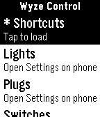
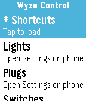
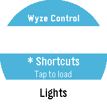

# Wyze Control for Pebble

**Control your Wyze smart home from your wrist.**

Wyze Control for Pebble turns your Pebble smartwatch into a direct control surface for your Wyze smart home ecosystem. Instead of reaching for your phone, you can toggle lights, check camera thumbnails, trigger automations, open or close your garage, and review health scale data — all from a compact, button-driven watch interface.

The app is built around the Pebble philosophy of quick, glanceable, purposeful interaction. Every action is reachable in a few button presses, and the UI is optimized for the small screen.

---

## License

This project is released under the **MIT License**.

```
MIT License

Copyright (c) 2026 MakeAwesomeHappen / ClickCalickClick

Permission is hereby granted, free of charge, to any person obtaining a copy
of this software and associated documentation files (the "Software"), to deal
in the Software without restriction, including without limitation the rights
to use, copy, modify, merge, publish, distribute, sublicense, and/or sell
copies of the Software, and to permit persons to whom the Software is
furnished to do so, subject to the following conditions:

The above copyright notice and this permission notice shall be included in all
copies or substantial portions of the Software.

THE SOFTWARE IS PROVIDED "AS IS", WITHOUT WARRANTY OF ANY KIND, EXPRESS OR
IMPLIED, INCLUDING BUT NOT LIMITED TO THE WARRANTIES OF MERCHANTABILITY,
FITNESS FOR A PARTICULAR PURPOSE AND NONINFRINGEMENT. IN NO EVENT SHALL THE
AUTHORS OR COPYRIGHT HOLDERS BE LIABLE FOR ANY CLAIM, DAMAGES OR OTHER
LIABILITY, WHETHER IN AN ACTION OF CONTRACT, TORT OR OTHERWISE, ARISING FROM,
OUT OF OR IN CONNECTION WITH THE SOFTWARE OR THE USE OR OTHER DEALINGS IN THE
SOFTWARE.
```

---

## Screenshots

| Aplite (B&W) | Basalt (Color) | Chalk (Round) |
|:---:|:---:|:---:|
|  |  |  |

---

## What You Need Before This App Will Work

This app requires several things to be set up correctly **before** it will function. Please read this section carefully.

### 1. A Pebble Smartwatch

The app runs on any Pebble hardware model:

| Platform | Device |
|----------|--------|
| `aplite` | Pebble Classic, Pebble Steel |
| `basalt` | Pebble Time, Pebble Time Steel |
| `chalk` | Pebble Time Round |
| `diorite` | Pebble 2 HR, Pebble 2 SE |
| `emery` | Pebble Time 2 |
| `flint` | Pebble 2 Duo |
| `gabbro` | Pebble Round 2 |

### 2. The Pebble or Rebble Mobile App

The watch app communicates with Wyze through PebbleKit JS running on your phone. You need either:

- The **Pebble** app (legacy, iOS/Android), or
- The **Rebble** companion app (community-maintained replacement)

The phone must be within Bluetooth range of the watch whenever you use this app.

### 3. A Wyze Account

You must have an active account at [wyze.com](https://wyze.com). The app authenticates directly against the Wyze cloud API using your Wyze account credentials.

### 4. Wyze Developer API Keys

This is a **required step** that many users miss. The Wyze API requires developer credentials in addition to your account email and password. You need:

- A **Key ID** (`keyid`)
- An **API Key** (`api_key`)

**How to get them:**

1. Visit the [Wyze Developer API Console](https://developer-api-console.wyze.com/).
2. Log in with your Wyze account.
3. Generate a new API key.
4. Copy both the **Key ID** and the **API Key** — you will need both.

These keys identify your developer API session and are required for all Wyze API calls. Without them, the app cannot authenticate.

### 5. Wyze Cloud Control Must Be Available for Your Devices

Some Wyze devices cannot be controlled through the cloud API:

- **Bluetooth-only devices** (such as the Wyze Lock Bolt without a Wi-Fi gateway) are visible in the app but cannot be controlled remotely.
- Devices must be online and connected to Wi-Fi to respond to commands.

---

## Installation

### Installing a Pre-Built Release

1. Download the latest `.pbw` file from the [Releases](../../releases) page.
2. Open the `.pbw` file on your phone — the Pebble or Rebble app will install it automatically.

### Building from Source

You need the Pebble SDK (v3) installed.

```bash
# Install dependencies
npm install

# Build for all platforms
pebble build

# Install to the basalt emulator
pebble install --emulator basalt
```

---

## Setup and Configuration

1. After installing the app, open the **Pebble** or **Rebble** app on your phone.
2. Find **Wyze Control** in your app list and tap the settings (gear) icon.
3. The configuration page will open in your phone's browser.
4. Enter the following:
   - **Wyze Account Email** — the email address for your Wyze account.
   - **Wyze Password** — your Wyze account password. See the [security section](#your-password-how-it-is-used-and-when-it-is-deleted) below.
   - **Wyze Key ID** — from the Wyze Developer API Console.
   - **Wyze API Key** — from the Wyze Developer API Console.
5. Tap **Save Settings**.
6. The app will authenticate with Wyze, exchange your password for a token, and begin loading your device list.

Once the token is stored on your phone, you will not need to re-enter your password unless the token expires or you log out.

---

## Your Password: How It Is Used and When It Is Deleted

**Wyze does not provide an OAuth login page.** Unlike apps that redirect you to a secure Wyze login screen (like "Sign in with Google"), there is no such option in the Wyze API. To authenticate, the app must briefly handle your email and password directly.

Here is exactly what happens, step by step:

1. **You type your password** into the configuration page and tap Save.
2. **Your password is hashed three times** using MD5 (triple-MD5) before it ever leaves your browser. This matches the format required by the Wyze authentication endpoint. Your plain-text password never exists in the app's storage or in the API request body.
3. **The hashed password is sent directly to Wyze** (`https://auth-prod.api.wyze.com/api/user/login`) and nowhere else. It is never forwarded to any third-party server.
4. **Wyze returns an `access_token` and a `refresh_token`**. These tokens are what the app stores and uses for all subsequent requests.
5. **Your password (and its hash) are immediately deleted** from your phone's local storage the moment the token exchange is complete. The raw password and the hashed value are not retained anywhere on your device after this point.
6. **From this point forward, only the token is used.** The app uses the stored token for all API calls. The token is refreshed automatically using the `refresh_token` when it expires.
7. **If you log out** (via the Log Out toggle in settings), all stored tokens are cleared from your phone. To use the app again, you would re-enter your credentials and the process repeats.

**Summary:** Your password exists in memory only for the duration of the login request, is never stored to disk, and is never transmitted to anyone other than Wyze's own authentication server.

---

## Features: What Works and What Does Not

### ✅ Working Features

#### Lights (Wyze Bulb, Mesh Lights, Light Strips)
- Toggle power on/off.
- Adjust brightness in fixed steps: 20%, 40%, 60%, 80%, 100%.
- Select color temperature presets: Soft White (2700K), Cool White (6500K).
- Select color presets: Red, Green, Blue.
- All light controls use the `set_property` API endpoint (not `run_action_list`, which does not work for MeshLight devices).

#### Plugs and Switches (Wyze Plug, Wyze Outdoor Plug, Switch)
- Toggle power on/off.
- Online/offline status displayed in the device list.
- *Note: Plugs and switches were not tested on a live device during development. The expected behavior is based on the same `set_property` P3 toggle that works for lights. See the [call for testers](#call-for-testers) section.*

#### Cameras (Wyze Cam, Wyze Cam Pan, etc.)
- Display the most recent motion event thumbnail directly on your watch.
- Event metadata: event type (motion, sound), event timestamp.
- Images are downloaded as JPEG, resized to 144×84 pixels, and converted to Pebble's 8-bit color format.
- Images are transmitted to the watch in 1,500-byte chunks via AppMessage.
- The correct iOS-style API parameters are used to generate valid signed image URLs (see [API Notes](#api-and-technical-notes)).
- Live streaming is not possible on Pebble hardware.

#### Garage Door Controller (Wyze Cam V3 + HL_CGDC Dongle)
- Trigger the garage door (toggle open/close) via a single button on the watch.
- The app tracks garage state locally after each trigger (since the Wyze cloud API does not expose real-time garage state — see below).
- The initial state is unknown until the first user-initiated action.
- Physical confirmation: 3/3 test triggers successfully moved the garage door.

#### Wyze Scale (Wyze Scale S)
- Display the most recent measurement: weight, body fat %, BMI, muscle mass, body water, and measurement timestamp.
- Unit conversion: the API returns weight in kg; the app converts to lbs based on your account's unit preference.
- Scale data is retrieved from a separate Wyze microservice (`wyze-scale-service.wyzecam.com`) using HMAC-signed authentication.

#### Shortcuts and Automations
- List all Wyze Rules and Shortcuts from your account.
- Trigger any shortcut from the watch with a single button press.
- Especially useful for routines like "Goodnight," "I'm Away," or custom automation sequences.

#### Device Status Display
- All devices show name, type, online/offline status, and current state in the device list.
- Cameras with a garage controller dongle are automatically detected and shown in both the Camera and Garage categories.

#### Token Refresh
- When an access token expires, the app automatically attempts to refresh it using the stored refresh token.
- If the refresh fails, the user is prompted to re-enter credentials.

---

### ⚠️ Partial or Limited Functionality

#### Garage Door — State Detection
The garage door trigger works reliably, but **real-time open/closed state is not available from the Wyze cloud API**. Extensive testing (25+ approaches across 5 test scripts) confirmed:

- The `P1056` (ACCESSORY) property is completely stale and does not update after API-triggered actions.
- The `devicemgmt` service has a schema for garage state (`door-state`, `open`) but all values are `null` for the camera model used.
- Real-time state is only available through the Wyze mobile app's P2P/WebRTC connection, which is not accessible from a REST API.

The app tracks state locally (toggling after each successful API call), but this state will desync if the door is operated manually, by another app, or by a Wyze automation.

#### Locks (Wyze Lock, Wyze Lock Bolt)
Locks are visible in the device list with status, but **cloud control of Bluetooth-only locks is not possible**. If you attempt to control a Bluetooth-only lock, the app shows "Cloud control unsupported." Locks with a Wi-Fi gateway may be controllable (untested — see [call for testers](#call-for-testers)).

---

### ❌ Not Working / Not Supported

| Feature | Reason |
|---------|--------|
| Multi-Factor Authentication (MFA) | MFA challenges are detected but not handled. If your account requires MFA for API access, login will fail. |
| Live camera streaming | Pebble hardware is not capable of decoding a live video stream. |
| Wyze Lock Bolt (Bluetooth-only) | No Wi-Fi path to cloud API. Display only. |
| Vacuum (Wyze Robot Vacuum) | Listed for visibility. No control actions implemented. |
| Other devices (headphones, etc.) | Listed as "Other." No specific control implemented. |
| `run_action_list` for MeshLight | Returns `INVALID_PARAMETER` from the Wyze API. The `set_property` endpoint is used instead. |

---

## Call for Testers

This app was developed and tested against a specific set of devices. Many Wyze products that **should** work have not been confirmed yet simply because we do not have them. We need real users with different hardware to test and expand the device support.

### Devices We Need Testers For

| Device | Expected Behavior | Status |
|--------|-------------------|--------|
| Wyze Plug | Power toggle (P3) | Not tested on live hardware |
| Wyze Outdoor Plug | Power toggle (P3) | Not tested on live hardware |
| Wyze Switch | Power toggle (P3) | Not tested on live hardware |
| Wyze Lock (with Wi-Fi gateway) | Lock/unlock control | Not tested — cloud path may work |
| Wyze Lock Bolt (Bluetooth-only) | Display only expected | Known limitation |
| Wyze Thermostat | Temperature control | Not yet implemented |
| Wyze Bulb Color (non-Mesh variants) | Brightness, color temp | Likely works, untested |
| Wyze Robot Vacuum | Start/stop/dock | Not yet implemented |
| Newer Wyze Cam models | Thumbnail display | Likely works, untested |

### How to Help

If you have a device not listed as confirmed working and want to help:

1. Install the app and configure it with your Wyze credentials.
2. Try the relevant controls and note what works and what doesn't.
3. Open an [Issue](../../issues) describing your device model, product type, and what happened.
4. If you have developer experience, the Node.js test scripts in the repo root (`test_api.js`, `wyze_test.js`, etc.) can be pointed at your own account using environment variables to explore the API response for your devices.

The Wyze API behavior is often different per product model. More testers with more products means we can figure out which API calls work for which hardware and expand functionality through direct testing rather than guesswork.

---

## API and Technical Notes

### Wyze API Sources and Credits

The Wyze API is not officially documented for third-party use. This project's API integration was pieced together from the following sources:

- **Wyze Developer API Console** — [developer-api-console.wyze.com](https://developer-api-console.wyze.com/)  
  Official developer portal for generating API keys. Provides limited documentation on the developer API tier.

- **docker-wyze-bridge** by mrlt8 — [github.com/mrlt8/docker-wyze-bridge](https://github.com/mrlt8/docker-wyze-bridge)  
  Community project that reverse-engineered Wyze API parameters for cameras. The breakthrough for camera thumbnail downloads (correct `sc`/`sv` parameters, iOS-style app metadata) came directly from studying `app/wyzecam/api.py` in this project.

- **ha-wyzeapi** (Home Assistant Wyze integration) — community reverse-engineering work  
  Referenced for garage door P1056 property definitions (`1`=open, `0`=closed by app, `2`=closed by automation) and lock handling patterns.

- **wyze-sdk** (Python) — community SDK  
  Referenced for endpoint inventory and device property schemas.

- **Direct API testing** — extensive live testing against the Wyze API is documented in [`WYZE_API_HELP_DOC.md`](WYZE_API_HELP_DOC.md) in this repository. All validated endpoints, payloads, and findings are recorded there.

### Key Validated Endpoints

| Endpoint | Purpose | Status |
|----------|---------|--------|
| `POST auth-prod.api.wyze.com/api/user/login` | Authentication | ✅ Working |
| `POST api.wyzecam.com/app/v2/home_page/get_object_list` | Device list | ✅ Working |
| `POST api.wyzecam.com/app/v2/device/set_property` | Device control (lights, plugs) | ✅ Working |
| `POST api.wyzecam.com/app/v2/device/get_event_list` | Camera events | ✅ Working (requires iOS params) |
| `POST api.wyzecam.com/app/v2/auto/run_action` | Shortcuts + garage trigger | ✅ Working |
| `GET wyze-scale-service.wyzecam.com/plugin/scale/get_latest_record` | Scale data | ✅ Working |
| `POST api.wyzecam.com/app/user/refresh_token` | Token refresh | ✅ Working |

### Authentication Details

Authentication uses a triple-MD5 hash of the password plus a nonce (current timestamp), matching the Wyze mobile app's login flow. Single MD5 or plain password submissions fail with HTTP 400. The full technical specification is in [`WYZE_API_HELP_DOC.md`](WYZE_API_HELP_DOC.md).

---

## Project Structure

```
src/c/           - Pebble C watchapp source
  WyzeControl.c        - Main app, AppMessage routing
  menu_types.c         - Top-level device type selector
  menu_devices.c       - Device list per type
  menu_shortcuts.c     - Shortcut/automation list
  menu_light_actions.c - Light control submenu
  window_actions.c     - Action window (power/brightness/color)
  window_camera.c      - Camera thumbnail display
  window_garage.c      - Garage door control
  window_scale.c       - Scale health metrics
  window_picker.c      - Generic picker window
  title_bar.c          - Persistent "Wyze Control" title bar

src/pkjs/        - PebbleKit JS (runs on phone)
  index.js             - Main JS: auth, device fetch, API calls
  config.js            - Clay settings page configuration
  md5.js               - MD5 implementation for password hashing

resources/       - App icons and images
```

---

## Supported Platforms

| Platform | Display | Colors |
|----------|---------|--------|
| Aplite (Pebble Classic) | 144×168 | 2-bit (B&W) |
| Basalt (Pebble Time) | 144×168 | 8-bit (64 colors) |
| Chalk (Pebble Time Round) | 180×180 | 8-bit (64 colors) |
| Diorite (Pebble 2) | 144×168 | 2-bit (B&W) |
| Emery (Pebble Time 2) | 200×228 | 8-bit (64 colors) |
| Flint (Pebble 2 Duo) | 144×168 | 2-bit (B&W) |
| Gabbro (Pebble Round 2) | 180×180 | 8-bit (64 colors) |

---

## Known Limitations Summary

- **No MFA support.** If your Wyze account has Multi-Factor Authentication enforced at the API level, login will fail. MFA support is planned for a future release.
- **Garage state is estimated.** The watch tracks door state locally after each trigger. If the door is operated outside the app, the displayed state will be wrong.
- **Bluetooth-only locks cannot be controlled.** Locks without a Wi-Fi gateway are display-only.
- **No live camera streaming.** Pebble does not have the processing power or bandwidth for live video. Only the most recent motion event thumbnail is shown.
- **Token-based auth only.** After the initial login, you should not need to re-enter your password. If the refresh token also expires, you will be prompted for credentials again.
- **Device limit.** The watch app can hold up to the firmware-defined maximum number of devices in memory. Very large device lists may be truncated.

---

## Contributing

Pull requests are welcome. If you want to add support for a new device type, improve the UI for a specific Pebble platform, or add a new API feature:

1. Fork the repo.
2. Create a feature branch.
3. Test against the emulator and real hardware if possible.
4. Submit a pull request describing what device or feature you tested and how.

For API research, the Node.js test scripts in the repo root are a good starting point. They use environment variables so credentials are never committed:

```bash
export WYZE_EMAIL='your@email.com'
export WYZE_PASSWORD='yourpassword'
export WYZE_API_KEY='your_api_key'
export WYZE_KEY_ID='your_key_id'
node wyze_test.js
```

---

## Disclaimer

This project is not affiliated with, endorsed by, or connected to Wyze Labs, Inc. in any way. "Wyze" is a trademark of Wyze Labs, Inc. This app uses the Wyze API in a manner consistent with community reverse-engineering efforts and is intended for personal, non-commercial use.

The Wyze API may change at any time without notice. If the app stops working, it is likely due to a change in the Wyze backend. Check the [Issues](../../issues) page for reports and updates.
